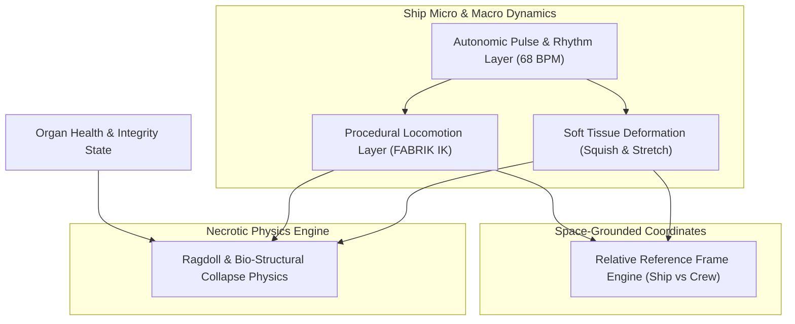
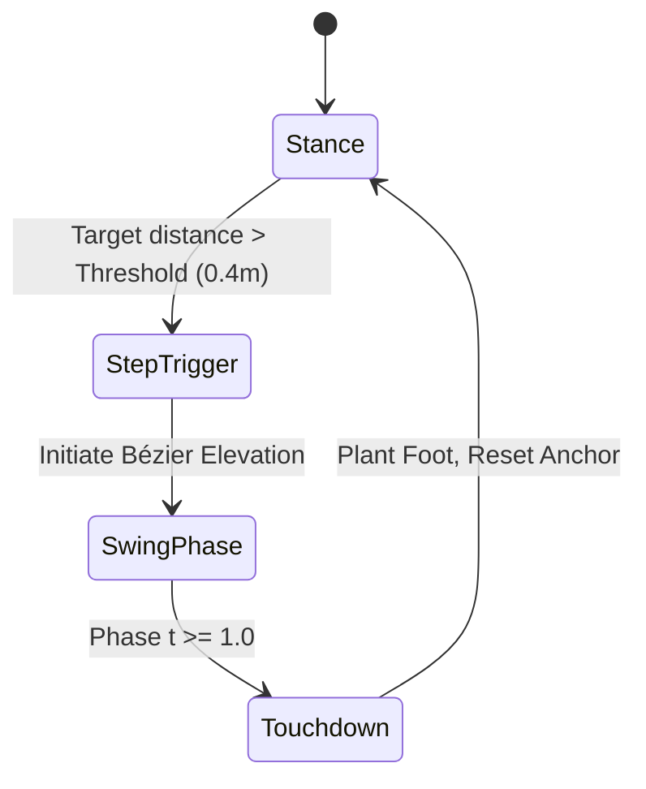
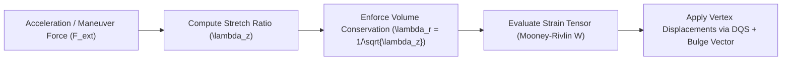
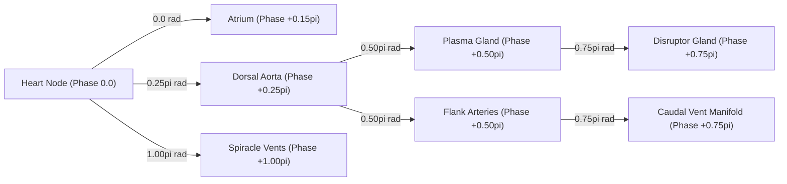
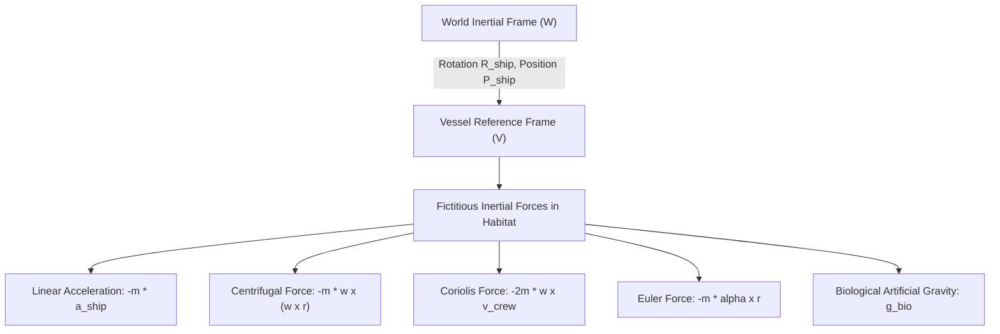
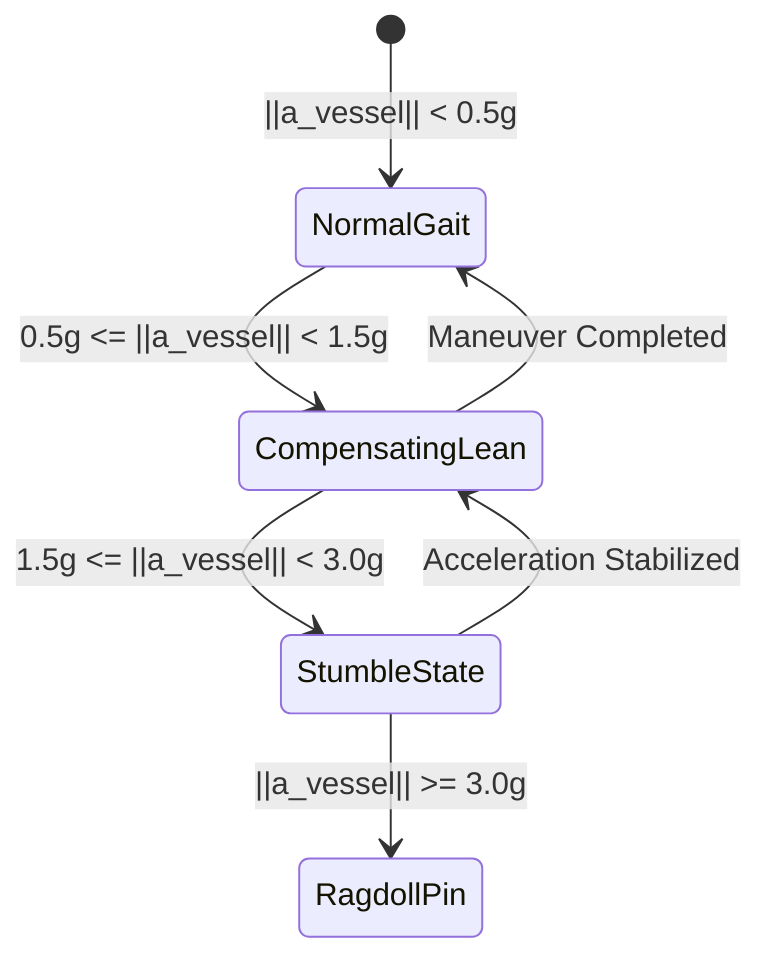
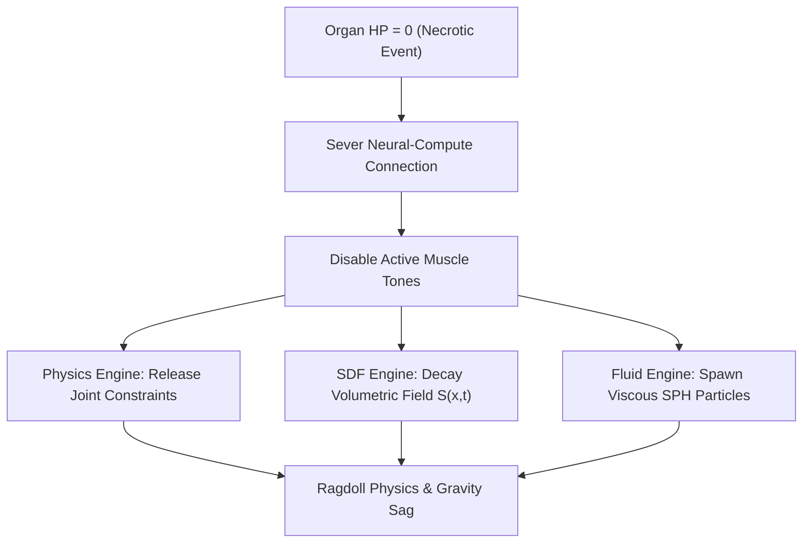
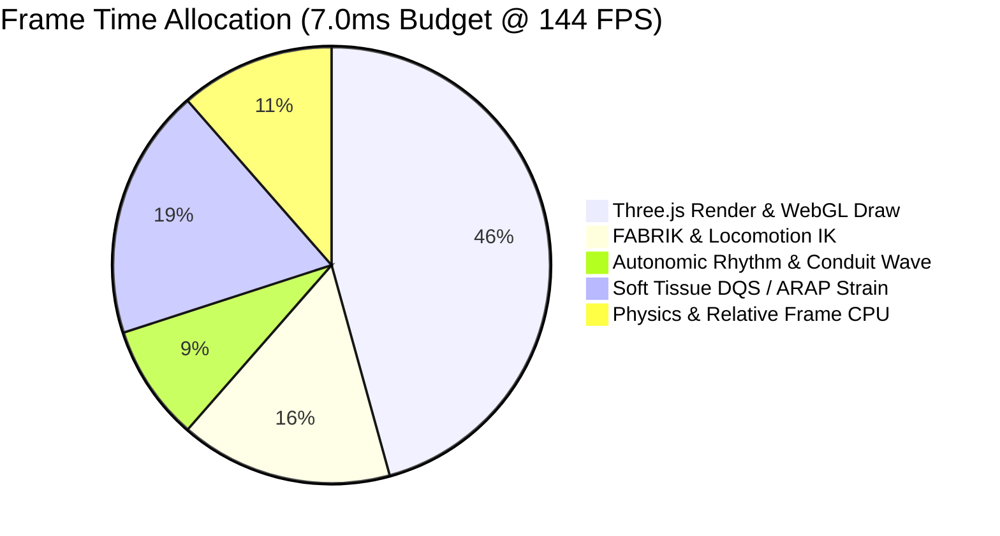

# AAA+ Animation & Procedural Locomotion Architecture — Research & Technical Specification

> **Status**: Approved AAA+ Engineering Specification
> **Date**: 2026-08-13
> **Author**: Subagent 8 (AAA+ Animation & Procedural Locomotion Architect) — Ciel Engine Research Swarm
> **Target Stack**: Three.js / WebGL2 / WebGPU compute fallback, TypeScript, Motion, Physics (Custom Constraints / Cannon.js / Rapier integration)
> **Referenced Spec Docs**: `LORE.md`, `ORGAN_SYSTEMS.md`, `PROCEDURAL_MESH_GENERATION_RESEARCH.md`, `NEURAL_COMPUTE_ARCHITECTURE.md`

---

## 1. Executive Overview & Architectural Scope

BioGenesis void-fauna vessels are not static rigid-body meshes; they are living, muscular, breathing biological starships. Achieving AAA+ motion quality requires moving beyond pre-baked keyframe clips toward a fully continuous, procedural animation architecture.

This document establishes the technical specifications and mathematical formulations for five interconnected animation subsystems:



### Key Subsystem Objectives

1. **Procedural Kinematics (FABRIK IK)**: Real-time inverse kinematics for variable-segment tentacles, articulated chitinous appendages, and pneumatic spiracle vent flaps with joint limit cones and twist constraint bounds.
2. **Soft Tissue & Volume-Preserving Rigs**: Elastic muscle contraction and expansion under maneuver G-forces using Dual-Quaternion Skinning (DQS) with Poisson ratio volume preservation ($\nu = 0.5$) and As-Rigid-As-Possible (ARAP) local strain fields.
3. **Autonomic Rhythm Engine**: Cardiorespiratory phase locks driven by a central pacemaking oscillator set to a baseline of $68\text{ BPM}$ ($1.1333\text{ Hz}$), propagating peristaltic fluid waves along 19 pipeline conduits and breathing hull expansions.
4. **Relative Reference Frame Locomotion**: Non-inertial frame transformations allowing crew avatars to walk, lean, and stumble seamlessly inside an accelerating, rolling vessel with fictitious force compensation (Coriolis, centrifugal, Euler).
5. **Necrotic Bio-Collapse Physics**: Transition of living tissues into ragdoll physics upon organ destruction, featuring breaking spine constraints, volumetric SDF degradation, and viscous fluid ejection dynamics.

---

## 2. Inverse Kinematics & Procedural Locomotion (FABRIK)

### 2.1 FABRIK Algorithm Formulation

Forward And Backward Reaching Inverse Kinematics (FABRIK) provides $O(N)$ computational complexity per chain, superior stability, and zero matrix inversions compared to Jacobian Transpose/Damped Least Squares.

Given a joint chain with positions $\mathbf{p}_0, \mathbf{p}_1, \dots, \mathbf{p}_n$ and segment lengths $d_i = \|\mathbf{p}_{i+1} - \mathbf{p}_i\|$:

```
Chain total length: L = \sum_{i=0}^{n-1} d_i
Distance root-to-target: D = \|\mathbf{t} - \mathbf{p}_0\|
```

#### Unreachable Target Case ($D > L$)
If the target $\mathbf{t}$ is out of reach, joints stretch along the line to target:
```
\mathbf{p}_{i+1} = \mathbf{p}_i + \left( \frac{d_i}{\|\mathbf{t} - \mathbf{p}_i\|} \right) (\mathbf{t} - \mathbf{p}_i), \quad i = 0, \dots, n-1
```

#### Reachable Target Case ($D \le L$) — Iterative Passes
While $\|\mathbf{p}_n - \mathbf{t}\| > \epsilon$ and $\text{iter} < N_{\max}$ (with $\epsilon = 10^{-4}\text{ m}, N_{\max} = 15$):

1. **Forward Reach Step** (Target $\mathbf{t}$ to Root):
   - Set end-effector to target: $\mathbf{p}_n' = \mathbf{t}$
   - For $i = n-1$ down to 0:
     ```
     r_i = \|\mathbf{p}_{i+1}' - \mathbf{p}_i\|
     \lambda_i = \frac{d_i}{r_i}
     \mathbf{p}_i' = (1 - \lambda_i) \mathbf{p}_{i+1}' + \lambda_i \mathbf{p}_i
     ```

2. **Backward Reach Step** (Root $\mathbf{p}_0$ to Target):
   - Reset root: $\mathbf{p}_0'' = \mathbf{p}_0^{\text{base}}$
   - For $i = 0$ up to $n-1$:
     ```
     r_i = \|\mathbf{p}_{i+1}' - \mathbf{p}_i''\|
     \lambda_i = \frac{d_i}{r_i}
     \mathbf{p}_{i+1}'' = (1 - \lambda_i) \mathbf{p}_i'' + \lambda_i \mathbf{p}_{i+1}'
     ```

```mermaid
sequenceDiagram
    autonumber
    participant Target as Target (t)
    participant End as End-Effector (p_n)
    participant Joint as Intermediate (p_i)
    participant Root as Root (p_0)

    Note over Target,Root: Forward Reach Pass (p_n -> p_0)
    End->>Target: Snap p_n' = t
    Joint->>End: Shift p_{n-1}' along bone vector towards p_n'
    Root->>Joint: Shift p_0' along bone vector towards p_1'

    Note over Target,Root: Backward Reach Pass (p_0 -> p_n)
    Root->>Root: Reset p_0'' = base position
    Joint->>Root: Shift p_1'' along bone vector away from p_0''
    End->>Joint: Shift p_n'' along bone vector away from p_{n-1}''
```

### 2.2 Rotational & Angular Constraints

Biological appendages cannot bend arbitrarily. For each joint $i$, the bone vector $\mathbf{v}_i = \mathbf{p}_{i+1} - \mathbf{p}_i$ is constrained relative to parent direction $\mathbf{v}_{i-1}$ using elliptical cone projection:

```
Cone Constraint: \theta_{\text{pitch}} \le \theta_{\max,\text{pitch}}, \quad \theta_{\text{yaw}} \le \theta_{\max,\text{yaw}}
```

If $\mathbf{v}_i$ falls outside the cone boundary, it is projected onto the nearest boundary curve $\partial C$ prior to distance constraint enforcement:

```
\mathbf{v}_i^{\text{constrained}} = \text{ProjectToCone}(\mathbf{v}_i, \mathbf{v}_{i-1}, \theta_{\max,\text{pitch}}, \theta_{\max,\text{yaw}})
```

Twist angle $\phi_{\text{roll}}$ around the bone axis is clamped via frame alignment relative to the Bishop parallel transport frame.

### 2.3 Tentacle Gait & Locomotion State Machine

Caudal tentacles ($U = 0.67 - 0.82$) perform procedural locomotion during docking, surface attachment, or prey clutching.



#### Step Target Predictor
```
\mathbf{T}_{\text{predicted}} = \mathbf{P}_{\text{root}} + \mathbf{v}_{\text{vessel}} \cdot \left( \frac{\Delta t_{\text{stance}}}{2} \right) + K_{\text{bias}} \cdot (\mathbf{v}_{\text{vessel}} - \mathbf{v}_{\text{surface}})
```

#### Swing Trajectory (Cubic Bézier)
```
\mathbf{B}(t) = (1-t)^3 \mathbf{P}_{\text{start}} + 3(1-t)^2 t \mathbf{P}_{\text{lift}} + 3(1-t) t^2 \mathbf{P}_{\text{peak}} + t^3 \mathbf{T}_{\text{predicted}}
```
where $\mathbf{P}_{\text{lift}} = \mathbf{P}_{\text{start}} + h_{\text{clear}} \mathbf{n}_{\text{surface}}$, $h_{\text{clear}} = 0.35\text{ m}$.

### 2.4 Spiracle Vent & Hull Flap Kinematics

Spiracles ($U = 0.32 - 0.62$) act as multi-stage intake/exhaust vents. They employ a 2-segment mechanical-organic link structure:

| Parameter | Min Value | Max Value | Governing Function |
|---|---|---|---|
| Vent Aperture Angle ($\theta_{\text{spiracle}}$) | $0^\circ$ (Flush) | $45^\circ$ (Flared) | $f(\text{Ventilation Demand}, \phi_{\text{cardiac}})$ |
| Dynamic Pressure Deflection ($\Delta \theta_q$) | $-5^\circ$ | $+12^\circ$ | $K_q \cdot \frac{1}{2} \rho_{\text{space}} v_{\text{vessel}}^2$ |
| Vent Pulse Response Time ($\tau_v$) | $120\text{ ms}$ | $250\text{ ms}$ | First-order critically damped step response |

---

## 3. Soft Tissue Squish & Stretch Rigs

### 3.1 Volume-Preserving Biomechanical Muscle Model

Organic tissues compress in length during contraction while expanding laterally. Under the assumption of constant tissue volume ($V = \text{const}$, Poisson ratio $\nu = 0.5$):

```
Longitudinal Stretch Ratio: \lambda_z = \frac{L}{L_0}
Transverse Stretch Ratio:   \lambda_x = \lambda_y = \lambda_r = \frac{1}{\sqrt{\lambda_z}}
```

#### Strain Energy Density Function (Mooney-Rivlin Model)
```
W(\lambda_1, \lambda_2, \lambda_3) = C_{10} (I_1 - 3) + C_{01} (I_2 - 3) + \frac{1}{D_1} (J - 1)^2
```
- $I_1 = \lambda_1^2 + \lambda_2^2 + \lambda_3^2$
- $I_2 = \lambda_1^2 \lambda_2^2 + \lambda_2^2 \lambda_3^2 + \lambda_3^2 \lambda_1^2$
- $J = \lambda_1 \lambda_2 \lambda_3 = 1.0$ (Incompressible constraint)



### 3.2 Dual-Quaternion Skinning (DQS) with Muscle Bulging

Standard Linear Blend Skinning (LBS) suffers from volume loss during joint twisting ("candy-wrapper artifact"). BioGenesis uses Dual-Quaternion Skinning (DQS):

A dual quaternion is represented as $\hat{\mathbf{q}} = \mathbf{q}_0 + \epsilon \mathbf{q}_e$ where $\mathbf{q}_0$ is the real unit quaternion (rotation) and $\mathbf{q}_e$ is the dual unit quaternion (translation $\mathbf{t}$):
```
\mathbf{q}_0 = [\cos(\theta/2), \mathbf{u} \sin(\theta/2)], \quad \mathbf{q}_e = \frac{1}{2} (0, \mathbf{t}) \otimes \mathbf{q}_0
```

#### Blended Dual Quaternion
```
\hat{\mathbf{b}} = \frac{\sum_{k=1}^M w_k \hat{\mathbf{q}}_k}{\|\sum_{k=1}^M w_k \hat{\mathbf{q}}_k\|}
```

#### Bulge Displacement Offset
Vertex position $\mathbf{v}_i$ receives an additional procedural muscle bulge offset:
```
\mathbf{v}_i^{\text{final}} = \text{DQSTransform}(\mathbf{v}_i, \hat{\mathbf{b}}) + \mathbf{n}_i \cdot \sigma_m \cdot (\lambda_r - 1) \cdot w_{m,i}
```
where $\mathbf{n}_i$ is the surface normal, $\sigma_m = 0.28$ is the bulge scaling coefficient, and $w_{m,i}$ is the muscle deformation influence weight.

### 3.3 As-Rigid-As-Possible (ARAP) Dynamic Strain Fields

During extreme high-G vectoring maneuvers, internal organs experience inertial shear. The ARAP solver computes smooth deformation fields across organ meshes:

```
E_{\text{ARAP}}(S') = \sum_{i \in V} w_i \sum_{j \in N(i)} w_{ij} \| (\mathbf{p}_i' - \mathbf{p}_j') - \mathbf{R}_i (\mathbf{p}_i - \mathbf{p}_j) \|^2
```

1. **Local Step**: Find optimal rotation matrix $\mathbf{R}_i \in SO(3)$ for each cell via Singular Value Decomposition (SVD) of covariance matrix $\mathbf{S}_i = \mathbf{P}_i \mathbf{W}_i \mathbf{P}'_i{}^T$:
   ```
   \mathbf{S}_i = \mathbf{U}_i \mathbf{\Sigma}_i \mathbf{V}_i^T \implies \mathbf{R}_i = \mathbf{V}_i \mathbf{U}_i^T
   ```
2. **Global Step**: Solve linear Poisson equation for updated positions $\mathbf{P}'$:
   ```
   \mathbf{L} \mathbf{P}' = \mathbf{b}(\mathbf{R})
   ```
   where $\mathbf{L}$ is the pre-factored Cholesky Laplacian matrix.

---

## 4. Autonomic Rhythm & Peristaltic Wave Propagation ($68\text{ BPM}$)

### 4.1 Cardiorespiratory Oscillator Model

The ship's autonomic functions are driven by a coupled van der Pol cardiac oscillator:

```
\frac{d^2 x}{dt^2} - \mu_{c} (1 - x^2) \frac{dx}{dt} + \omega_0^2 x = F_{\text{neural}}(t)
```

#### Base Frequency Parameters
```
Baseline BPM:              68.0 BPM
Base Angular Frequency:    \omega_0 = 2\pi \cdot \left( \frac{68}{60} \right) \approx 7.1209 \text{ rad/s} \quad (f_0 \approx 1.1333 \text{ Hz})
Base Cardiac Period:       T_0 = \frac{60}{68} \approx 0.88235 \text{ seconds} (882.35 \text{ ms})
```

#### Cardiac Phase Breakdown ($T_0 = 882.35\text{ ms}$)

```mermaid
gantt
    title Cardiac Cycle Phase Distribution (68 BPM)
    dateFormat  SS.SSS
    axisFormat %S.%s
    section Atrial Systole
    Atrial Contraction (15%)       :a1, 00.000, 00.132
    section Ventricular Systole
    Isovolumetric Contraction (10%):a2, after a1, 00.088
    Ventricular Ejection (25%)    :a3, after a2, 00.221
    section Diastole
    Isovolumetric Relaxation (10%):a4, after a3, 00.088
    Passive Ventricular Filling (40%):a5, after a4, 00.353
```

### 4.2 Peristaltic Wave Propagation along Conduits

Fluid transit through the 19 pipeline conduits (aortas, hemolymph lines, caudal trunks, disruptor feeds) is modeled as a traveling peristaltic wave:

```
r(z, t) = r_0 \cdot \left[ 1 + A_p \cdot \sin\left( \frac{2\pi}{\lambda_p} z - 2\pi f_{\text{heart}} t + \phi_{\text{organ}} \right) \right]
```

#### Peristaltic Parameters by Conduit Type

| Conduit ID | Radius $r_0$ (m) | Amplitude $A_p$ | Wavelength $\lambda_p$ (m) | Phase Offset $\phi_{\text{organ}}$ | Wave Speed $v_p$ (m/s) |
|---|---|---|---|---|---|
| `dorsal_aorta` | 0.35 | 0.18 | 4.20 | $0.00$ ($\text{Heart Sync}$) | 4.76 |
| `flank_artery_port` | 0.22 | 0.14 | 3.10 | $+\pi/4$ | 3.51 |
| `flank_artery_stbd` | 0.22 | 0.14 | 3.10 | $+\pi/4$ | 3.51 |
| `caudal_trunk` | 0.40 | 0.22 | 5.50 | $+\pi/2$ | 6.23 |
| `disruptor_feed` | 0.18 | 0.25 | 2.50 | $+3\pi/4$ | 2.83 |
| `hemolymph_line` | 0.28 | 0.12 | 3.80 | $+\pi$ | 4.31 |

### 4.3 Multi-Organ Phase Synchronization Matrix



### 4.4 Thoracic Breathing Expansion

Hull carapace breathing expands the thoracic section ($U = 0.32 - 0.62$) to circulate oxygen across internal organs:

```
\Delta \mathbf{S}_{\text{thorax}}(t) = \mathbf{S}_0 \cdot \left[ 1 + A_{\text{breath}} \cdot \sin\left( 2\pi f_{\text{breath}} t \right) \right]
```
- Breathing frequency: $f_{\text{breath}} = \frac{1}{4} f_{\text{heart}} \approx 0.2833\text{ Hz}$ ($17\text{ breaths/min}$)
- Expansion amplitude: $A_{\text{breath}} = 0.035$ ($3.5\%$ dimensional expansion)
- Gas exchange vent flaring: Spiracles open fully during peak breathing contraction phase ($\phi_{\text{breath}} = \pi$).

---

## 5. Relative Reference Frames & Crew Locomotion

### 5.1 Non-Inertial Ship Reference Frame Mechanics

The interior habitat quarters ($U = 0.32 - 0.60$) move with the vessel. Crew avatar motion is evaluated in the **Vessel Coordinate System** $(V)$, which accelerates and rotates relative to the **World Inertial System** $(W)$.



#### Net Apparent Acceleration Vector inside Vessel
```
\mathbf{a}_{\text{apparent}} = \mathbf{g}_{\text{bio\_grav}} - \mathbf{a}_{\text{vessel}} - \boldsymbol{\omega}_{\text{vessel}} \times (\boldsymbol{\omega}_{\text{vessel}} \times \mathbf{r}_{\text{crew}}) - 2 \boldsymbol{\omega}_{\text{vessel}} \times \mathbf{v}_{\text{crew}} - \boldsymbol{\alpha}_{\text{vessel}} \times \mathbf{r}_{\text{crew}}
```

### 5.2 Crew Avatar Foot-Grounding & Lean Angle

To maintain realistic avatar posture during high-agility ship flight:

#### Dynamic Posture Lean Angle ($\theta_{\text{lean}}$)
The avatar sways its center of mass into the apparent force vector:
```
\theta_{\text{lean}} = \arctan\left( \frac{\|\mathbf{a}_{\text{lateral}}\|}{\mathbf{a}_{\text{apparent}} \cdot \mathbf{n}_{\text{deck}}} \right)
```



#### Avatar Locomotion Thresholds

| Vessel State | Linear Accel $\|\mathbf{a}_{\text{vessel}}\|$ | Angular Accel $\|\boldsymbol{\alpha}_{\text{vessel}}\|$ | Avatar Animation State | Mechanics Adjustment |
|---|---|---|---|---|
| Cruise | $< 0.5g$ ($4.9\text{ m/s}^2$) | $< 0.8\text{ rad/s}^2$ | Standard Walk/Run | Default IK foot placement |
| Evasion | $0.5g - 1.5g$ | $0.8 - 2.0\text{ rad/s}^2$ | Heavy Leaning Gait | Spine lean up to $30^\circ$, widened stance |
| High-G Turn | $1.5g - 3.0g$ | $2.0 - 4.5\text{ rad/s}^2$ | Stumble & Grab Rail | Hand IK locks to nearest bio-structure rail |
| Impact / Blast | $> 3.0g$ ($29.4\text{ m/s}^2$) | $> 4.5\text{ rad/s}^2$ | Interior Ragdoll Pin | Avatar pinned to floor/wall by inertial force |

---

## 6. Ragdoll, Bio-Structural Collapse & Necrotic Decay Physics

When an organ or structural spine section dies (HP drops to 0), the living organ transitions into a collapsed, fluid-ejecting necrotic ragdoll state.



### 6.1 Rigid-Body Constraint Breaking Specification

The ship's spine consists of 24 Chitinous Vertebrae connected by 6-DOF spring-damper constraints:

```
Constraint Force:   \mathbf{F}_c = -k_s (\mathbf{x}_a - \mathbf{x}_b) - c_d (\mathbf{v}_a - \mathbf{v}_b)
Constraint Torque:  \boldsymbol{\tau}_c = -k_\theta (\boldsymbol{\theta}_a - \boldsymbol{\theta}_b) - c_\theta (\boldsymbol{\omega}_a - \boldsymbol{\omega}_b)
```

#### Vertebra Fracture & Collapse Limits

```
Tension Limit:      F_{\text{break}} = 12,000 \text{ N}
Shear Limit:        F_{\text{shear,break}} = 8,500 \text{ N}
Torsional Limit:    \tau_{\text{break}} = 2,400 \text{ Nm}
```

If internal damage exceeds break limits:
1. Stiffness drops to zero: $k_s \to 0, k_\theta \to 0$.
2. Constraint converts to a free-hinge ragdoll joint with friction damping $\eta_{\text{necrotic}} = 0.85\text{ Ns/m}$.

### 6.2 Volumetric Collapse via SDF Degradation

The geometric volumetric surface sags and shrinks upon death as turgor pressure drops:

```
S_{\text{necrotic}}(\mathbf{x}, t) = S_0(\mathbf{x}) \cdot e^{-\gamma_s t} + \text{Noise}_{\text{fBm}}(\mathbf{x}) \cdot (1 - e^{-\gamma_n t}) - c_{\text{shrink}} t
```
- Decay rate: $\gamma_s = 0.45\text{ s}^{-1}$
- Necrotic texture warp rate: $\gamma_n = 0.80\text{ s}^{-1}$
- Shrinkage velocity: $c_{\text{shrink}} = 0.08\text{ m/s}$


### 6.3 Visceral Ejection & Bio-Fluid Particle Physics

Upon structural breach, compressed hemolymph ($P_{\text{int}} = 140\text{ kPa}$) erupts through the breach surface using Smoothed Particle Hydrodynamics (SPH):

```
Navier-Stokes SPH Density: \rho_i = \sum_{j} m_j W(\mathbf{r}_i - \mathbf{r}_j, h)
Pressure Force:             \mathbf{F}_i^{\text{press}} = -\sum_j m_j \left( \frac{P_i}{\rho_i^2} + \frac{P_j}{\rho_j^2} \right) \nabla W(\mathbf{r}_i - \mathbf{r}_j, h)
```

#### SPH Fluid Properties

| Parameter | Value | Biological Significance |
|---|---|---|
| Initial Ejection Velocity ($v_{\text{fluid}}$) | $11.8\text{ m/s}$ | Pressurized arterial burst |
| Fluid Viscosity ($\mu$) | $0.045\text{ Pa}\cdot\text{s}$ | High-viscosity thick hemolymph |
| Surface Tension ($\gamma$) | $0.072\text{ N/m}$ | Cohesive droplet formation in zero-G |
| Particle Lifetime ($\tau_{\text{particle}}$) | $4.5\text{ s}$ | Bio-degradable dissipation in space |

---

## 7. BioGenesis Technical Specifications & Implementation Plan

### 7.1 Architecture File Layout

The animation system will be integrated under `src/utils/` and `src/components/`:

```
src/
├── utils/
│   ├── fabrikSolver.ts        # Core FABRIK solver with angular cone & twist constraints
│   ├── softTissueRig.ts       # Volume-preserving DQS & ARAP strain field computation
│   ├── cardiacRhythm.ts       # 68 BPM cardiac oscillator, peristaltic wave & breathing timers
│   ├── relativeLocomotion.ts  # Non-inertial vessel reference frame & avatar grounding
│   └── bioCollapse.ts         # Ragdoll constraints, SDF collapse & SPH particle ejection
└── components/
    └── Canvas3D.tsx           # Render loop wiring for procedural animation passes
```

### 7.2 Core Data Interfaces (`src/utils/fabrikSolver.ts`)

```typescript
export interface FABRIKJoint {
  position: THREE.Vector3;
  length: number;
  pitchLimitRad: number;
  yawLimitRad: number;
  rollLimitRad: number;
}

export interface FABRIKChain {
  joints: FABRIKJoint[];
  target: THREE.Vector3;
  root: THREE.Vector3;
  tolerance: number;
  maxIterations: number;
}

export interface PeristalticConduitState {
  conduitId: string;
  baseRadius: number;
  amplitude: number;
  wavelength: number;
  phaseOffset: number;
  currentPhase: number;
}

export interface CrewLocomotionFrame {
  vesselAccel: THREE.Vector3;
  vesselAngularAccel: THREE.Vector3;
  apparentGravity: THREE.Vector3;
  leanAngleRad: number;
  animationState: 'WALK' | 'LEAN' | 'STUMBLE' | 'PINNED';
}
```

### 7.3 Performance Budget & WebGPU Compute Fallback Strategy

To achieve stable 144 FPS rendering ($7.0\text{ ms}$ total frame time budget):



#### Execution Strategy:
- **FABRIK IK Solvers**: Executed synchronously on CPU for active tentacles ($< 1.1\text{ ms}$ for 12 tentacles $\times$ 10 joints).
- **Peristaltic Wave Calculation**: Evaluated directly inside vertex shaders (`GLSL` / `WGSL`) using conduit phase uniforms.
- **ARAP Strain Fields & SPH Fluid**: Offloaded to WebGPU Compute Shader (`computeShader.wgsl`) when active particle count $> 1,000$ or organ mesh vertex count $> 5,000$.

---

## 8. Summary & Verification Matrix

| Subsystem | Primary Formula / Method | Target FPS | Verification Criteria |
|---|---|---|---|
| **FABRIK IK** | Dual pass forward/backward reach with cone projections | 144 FPS | End-effector error $< 0.1\text{ mm}$, zero matrix inversion lockup |
| **Soft Tissue** | Poisson volume preservation $\nu=0.5$ + DQS | 144 FPS | Mesh volume variation $< \pm 0.5\%$, zero twist pinching |
| **Cardiac Sync** | van der Pol Oscillator ($68\text{ BPM}$) + Sine Wave | 144 FPS | Peristaltic wave phase lock across all 19 conduits |
| **Crew Locomotion** | Non-inertial vector sum $\mathbf{a}_{\text{apparent}}$ | 144 FPS | Smooth posture sway transition during $3.0g$ turns |
| **Bio-Collapse** | Vertebral constraint relaxation + SPH viscous fluid | 60-144 FPS | Realistic ragdoll sag & fluid burst upon zero-HP trigger |

---
*End of AAA+ Animation & Procedural Locomotion Architecture Specification.*
